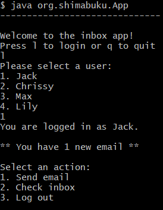
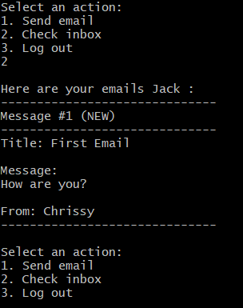
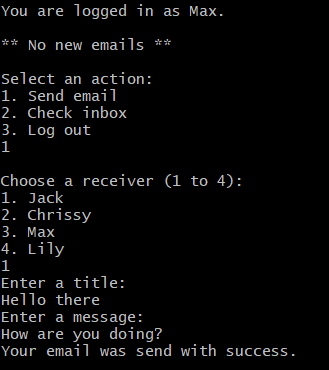
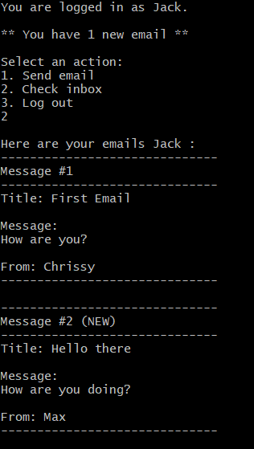

# Inbox Console App

This is a console application that simulates an inbox service. Users can log in, send and receive emails and log out.

## How to run the app

1. Make sure to have Java installed

   - run `java -version` on a terminal window

2. Download or clone the repository

3. Open a terminal window in the repository foler

4. Go to the classes folder

   ```cmd
   cd target/classes
   ```

5. Execute the following command :
   ```cmd
   java org.shimabuku.App
   ```

## How to use the Inbox App

1. Choose a user to login as
2. Select an option
   - Send email
   - Check inbox

## User Stories

- A user can send an email to another user (including themselves)
- A user can see the available recipients when sending an email
- A user can check their emails
- A user can see how many new messages they have when they login

## Features

- Send email

  - Prints all emails of the current user
  - Emails get stored during runtime and get send to the specified receiver
  - Emails get validated. Title, message and receiver are required

- Check inbox
  - Prints all emails of the current user
  - All new emails have a `(NEW)` tag next to the title
  - Emails are marked as read whenever the inbox is checked

## What it looks like

- Log In

  

- Check Inbox

  

- Send Email

  

- New + Read Emails

  
